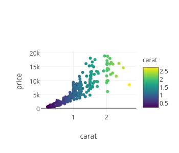
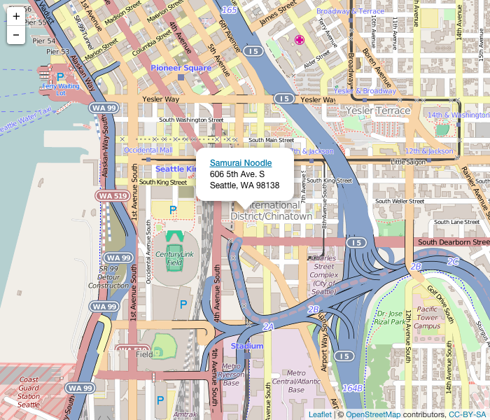
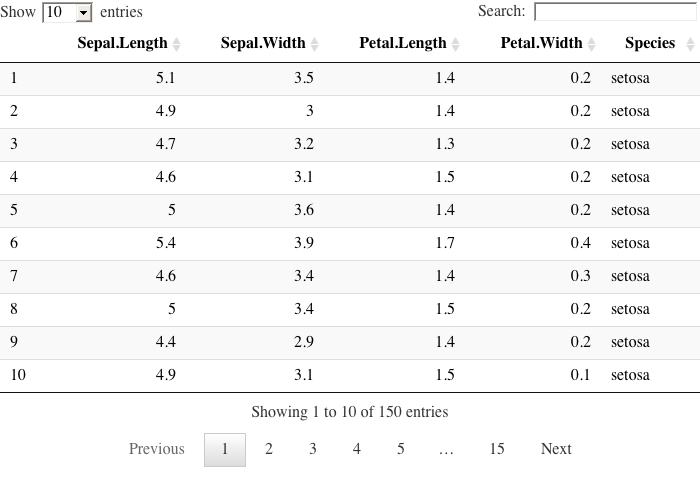
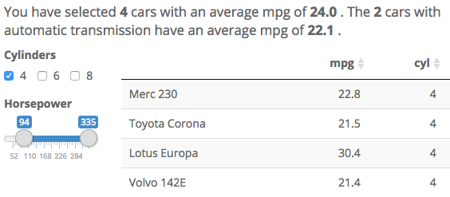
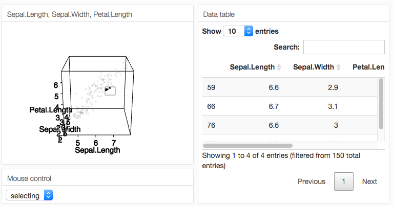
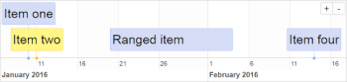
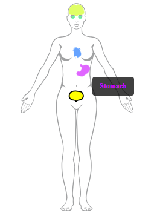

This page lists some HTML widgets that are compatible with Crosstalk.

(To add a widget, please submit a PR with modifications to [this page](https://github.com/rstudio/crosstalk/edit/main/docs/widgets.Rmd).)

<style type="text/css">
img.widget-thumbnail {
  width: 225px;
  height: auto;
  border: 1px solid #e6e6e6;
  float: left;
  padding: 3px;
  margin-right: 20px;
  margin-bottom: 40px;
}
.section.level3 hr {
  clear: both;
}
</style>


---

[{.widget-thumbnail}](https://cpsievert.github.io/plotly_book/)

### [Plotly](https://cpsievert.github.io/plotly_book/)

**Author:** [Carson Sievert](https://github.com/cpsievert)

Plotly is a general purpose plotting library that outputs interactive web graphics using [plotly.js](https://plot.ly/javascript/).

```r
devtools::install_github("plotly/plotly")
```


---

[{.widget-thumbnail}](https://rstudio.github.io/leaflet/)

### [Leaflet](https://rstudio.github.io/leaflet/)

**Author:** [RStudio](https://github.com/rstudio)

Leaflet lets you easily generate interactive maps using R. It is a wrapper for the very popular [Leaflet JavaScript library](http://leafletjs.com/) by [Vladamir Agafonkin](http://agafonkin.com/en/).

```r
devtools::install_github("rstudio/leaflet")
```


---

[{.widget-thumbnail}](https://rstudio.github.io/DT/)

### [DT](https://rstudio.github.io/DT/)

**Author:** [RStudio](https://github.com/rstudio)

DT is a highly customizable data table library. It wraps the [DataTables plug-in for jQuery](https://datatables.net/).

```r
devtools::install_github("rstudio/DT")
```

---

[{.widget-thumbnail}](https://kent37.github.io/summarywidget/)

### [SummaryWidget](https://kent37.github.io/summarywidget/)

**Author:** [Kent Johnson](https://github.com/kent37)

A SummaryWidget displays a single summary statistic that updates when the Crosstalk selection changes. A SummaryWidget displays the count, sum or mean of one column of selected data.

```r
devtools::install_github("kent37/summarywidget")
```


---

[{.widget-thumbnail}](https://dmurdoch.github.io/rgl/)

### [rgl](https://dmurdoch.github.io/rgl/)

**Author:** Duncan Murdoch and Daniel Adler

rgl is a 3D visualization system based on OpenGL. It
provides a medium to high level interface for use in R,
currently modelled on classic R graphics, with extensions
to allow for interaction.  See the `?rgl::rglShared`
help topic for details of `crosstalk` usage.

```r
devtools::install_github("dmurdoch/rgl")
```


---
[{.widget-thumbnail}](https://github.com/daattali/timevis)

### [timevis](https://github.com/daattali/timevis)

**Author:** [Dean Attali](https://github.com/daattali)

`timevis` lets you create interactive timeline visualizations in R.
This package is based on the [visjs](https://visjs.github.io/vis-timeline/docs/timeline/)
Timeline JavaScript library.


```r
devtools::install_github("daattali/timevis")
```


---
[{.widget-thumbnail}](https://github.com/robert-norberg/shinybody)

### [shinybody](https://github.com/robert-norberg/shinybody)

**Author:** [Robert Norberg](https://github.com/robert-norberg)

`shinybody` is an `htmlwidget` of the human body that allows you to hide/show
and assign colors to 79 different body parts.


```r
install.packages("shinybody")
```


---
